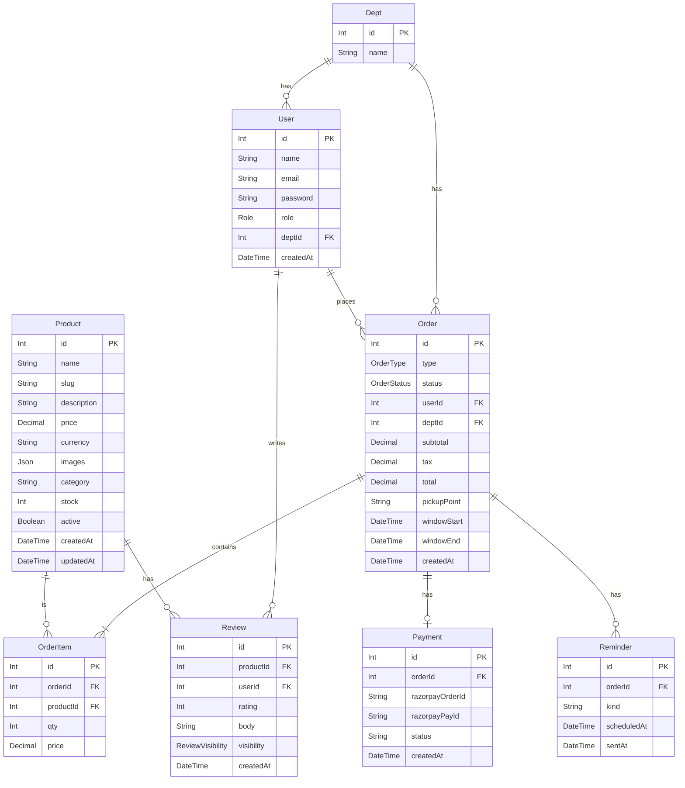

# Entity-Relationship Diagram

```mermaid
erDiagram
    Dept {
        Int id PK
        String name
    }

    User {
        Int id PK
        String name
        String email
        String password
        Role role
        Int deptId FK
        DateTime createdAt
    }

    Product {
        Int id PK
        String name
        String slug
        String description
        Decimal price
        String currency
        Json images
        String category
        Int stock
        Boolean active
        DateTime createdAt
        DateTime updatedAt
    }

    Order {
        Int id PK
        OrderType type
        OrderStatus status
        Int userId FK
        Int deptId FK
        Decimal subtotal
        Decimal tax
        Decimal total
        String pickupPoint
        DateTime windowStart
        DateTime windowEnd
        DateTime createdAt
    }

    OrderItem {
        Int id PK
        Int orderId FK
        Int productId FK
        Int qty
        Decimal price
    }

    Review {
        Int id PK
        Int productId FK
        Int userId FK
        Int rating
        String body
        ReviewVisibility visibility
        DateTime createdAt
    }

    Payment {
        Int id PK
        Int orderId FK
        String razorpayOrderId
        String razorpayPayId
        String status
        DateTime createdAt
    }

    Reminder {
        Int id PK
        Int orderId FK
        String kind
        DateTime scheduledAt
        DateTime sentAt
    }

    Dept ||--o{ User : "has"
    Dept ||--o{ Order : "has"
    User ||--o{ Order : "places"
    User ||--o{ Review : "writes"
    Order ||--|{ OrderItem : "contains"
    Order ||--o| Payment : "has"
    Order ||--o{ Reminder : "has"
    Product ||--o{ OrderItem : "is"
    Product ||--o{ Review : "has"

```
